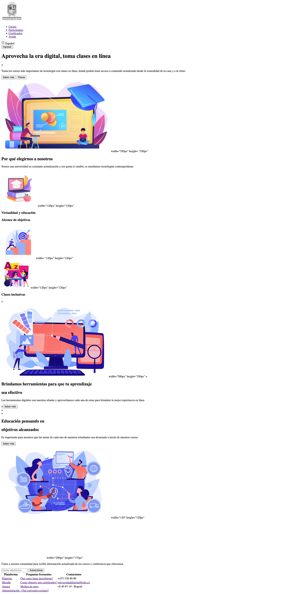

<h1>Taller 9: Juan Esteban Gamboa </h1>                                              

<h2> Informacion </h2>

 Curso: Full stack basico- grupo 1 

 profesor: Cristian Patiño 
 

<h2>Punto 1: Link de figma </h2>
<a href= "https://www.figma.com/file/jX4xAgypHbSwDkps0Jqd72/Juan-Esteban-Gamboa-%2F-Figma-Exercise?type=design&node-id=28%3A383&t=uTpN7BfPDroiRee2-1" >Link de figma</a>

<h2>Link de pagina web</h2>
<a href= "https://juangamboam.github.io/Taller_9_Atenea/" >Link pagina web</a>

<h2>Punto 2: html</h2>

<h2>Punto 3: CSS</h2> 

<h2>Punto 4: titulos</h2>

<h2>Punto 5: Estilos de texto</h2>

<h2>Punto 6: Enlaces</h2>

<h2>Punto 7-8: Navegación</h2>

<h2>Punto 9: Tablas</h2>

